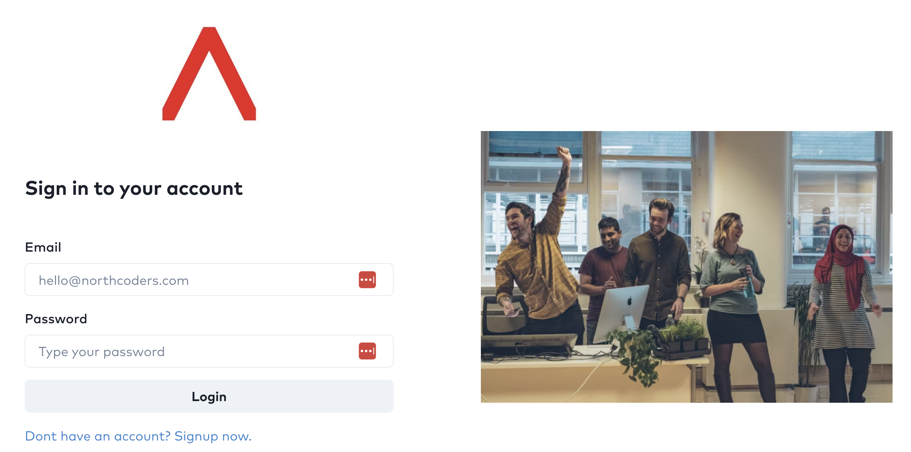

# Cloud Engineering - Team Project

## 👩‍💻 Scenario

The Northcoders development teams have worked on creating a learner management system

The development teams have been structured by the organisation such that one team has produced the frontend and a separate team have produced the backend.

The backend application is configured to talk to a relational database. Currently the backend team have been using an in-memory relational database when testing.

### Frontend

#### Technologies

* [Vite](https://vitejs.dev/)
* [React](https://react.dev/)
* HTML
* CSS

#### Repository

[https://github.com/northcoders/ce-team-project-frontend](https://github.com/northcoders/ce-team-project-frontend)

### Backend

#### Technologies

* Java
* [Maven](https://maven.apache.org/)
* [Spring Boot](https://spring.io/projects/spring-boot)
* Spring Actuator
* Spring JDBC for database access

#### Repository

[https://github.com/northcoders/ce-team-project-backend](https://github.com/northcoders/ce-team-project-backend)

## 📈 Objective

Your primary objective, as a team, is to get the applications and supporting services deployed to AWS cloud.

You should make sure to utilse the various topics that have been covered during the programme.

Also be considerate of the DevOps values - flow, feedback and continual learning. When making decisions, try to document which principle(s) of DevOps are impacted by those decisions.

## 🤔 Considerations

* You will need to fork/copy the frontend and backend application repositories if you need to change them or add new files.

* The applications don't currently have much logging in them. Adding logging and attempting to centralise the logs could be a good stretch goal. Something that has not yet been covered on the programme.

## 🏆 Minimum viable product

* All infrastructure/services you make should be created with infrastructure as code

* Frontend being built, tested and packaged in an automated CI fashion

* Backend being built, tested and packaged in an automated CI fashion

* An automated way of deploying the frontend in either a continuous delivery or continuous deployment fashion.

* An automated way of deploying the backend in either a continuous delivery or continuous deployment fashion.

* A clear, well documented README that guides a reader through the steps required re-create the environment.
    - You can assume the reader has an AWS account
    - You can assume the reader has all the required software installed locally such as Terraform, Kubernetes, kubectl, Helm etc

* A presentation (using whichever presentation tool you wish) that shares:
    - Your ways of working such as how you distributed the work, who took up which responsibilities
    - Tooling used and why you chose that tool (it was taught on the programme is not a valid reason)
    - A visual overview of the architecture and tools you have utilised
    - Any code examples you wish to share
    - Challenges you experienced and how you overcame them
    - The presentation should last around 5 to 6 mins

## 💰 Important notes on costs

* If you have provisioned an EKS cluster, make sure to destroy it when not testing to avoid incurring surplus AWS costs

* For EKS clusters, configure your node groups with a single node. In a non-learning environment you would increase the number of nodes but for this project, in order to save costs, having a single node is absolutely fine.

## 🤔 FAQs

We have collected a list of [Formerly Asked Questions (FAQs)](./FAQS.md)