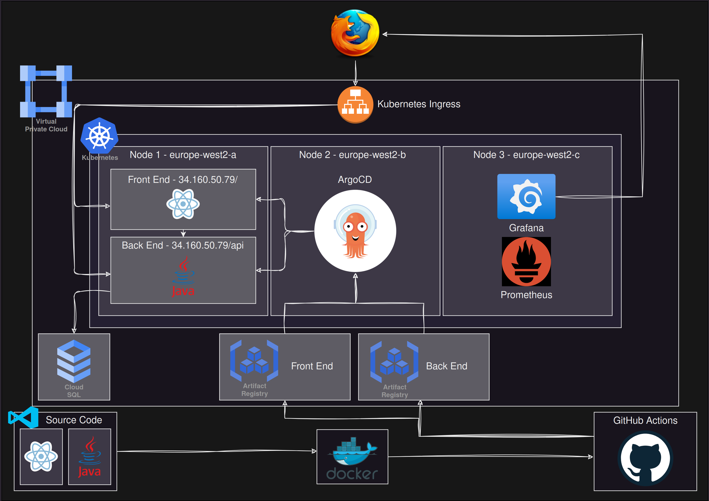

# Google Cloud Project Replica

## 👩‍💻 Scenario

The Northcoders development teams have worked on creating a learner management system


The development teams have been structured by the organisation such that one team has produced the frontend and a separate team have produced the backend.

The backend application is configured to talk to a relational database. Currently the backend team have been using an in-memory relational database when testing.

### Frontend

#### Technologies

- [Vite](https://vitejs.dev/)
- [React](https://react.dev/)
- HTML
- CSS

#### Repository

[https://github.com/MWyssy-gcp-project-replica-frontend-public](https://github.com/MWyssy-gcp-project-replica-frontend-public)

### Backend

#### Technologies

- Java
- [Maven](https://maven.apache.org/)
- [Spring Boot](https://spring.io/projects/spring-boot)
- Spring Actuator
- Spring JDBC for database access

#### Repository

[https://github.com/MWyssy-gcp-project-replica-backend-public](https://github.com/MWyssy-gcp-project-replica-backend-public)

## Infrastructure



### Hosting

This repository will set up a cloud infrastructure as above. The front and back ends are both hosted in a kubernetes cluster, and are running in docker containers. In order to access the cluster, there is a single ingress that points to the back end for any endpoint starting with the prefix /api, and the front end for any other endpoint. The ingress creates a loadbalancer to distribute traffic across the nodes, meaning multiple replicas can be used for easy scaling.

### Database

The Postgresql database has been migrated to Google Cloud SQL. This means that there is one instance of the database that can be accessed by multiple replica's of the backend, resulting in an infrastructure that can scale without losing access to, or duplicating, the data.

### CI/CD

CI/CD pipelines are set up to fully automate the testing, building, and deployment of the front and back ends. This is acheived through GitHub actions, for the testing and building of the docker containers, and ArgoCD, for the deployment of the images to the kubernetes cluster. Google Artifact Registry's have been set up to store the docker images. This means that when a commit is pushed to the main branch of both the front end and back end repositories, the updated app will be published in a matter of minutes.

### Observability

Observability is acheived through Prometheus and Grafana. At the moment, only metrics for the back end are measured. Some custom metrics have been added to the back end, however, if more extensive observability is required, please ask the back end dev team to add them.

### Testing

Tests have been added to the front end via Vite Test. Tests were already inmplemented in the back end. These tests are automatically run during the CI pipeline, ensuring that no code that fails the tests can be published. It is recommended that the respective dev teams ensure that the tests are robust and comprehensive.

## Setup

The entire infrastructure has been provisioned using terraform, which is all included in this repository. It is assumed that relevant dependencies are already installed (eg, Terraform, Helm, Gcloud etc), and that the user has been granted all of the necessary IAM permissions for Google Cloud.

#### Infrastructure:

Remote State:

> This will set up the remote state used by terraform.
> Before running this, please make sure you have the **Cloud Storage** API enabled in your Google Cloud environment.

- Change directory to _\_remote-state_: `$ cd _remote-state`
- Initialise Terraform: `$ terraform init`
- Apply Terraform: `$ terraform apply` (_Please note, storage buckets have globally unique names, so if you need to use multiple versions of this infrastructure, you will need to amend the name of the bucket_)

Core Infrastructure:

> This will set up:
>
> - VPC via Compute Engine (GCE)
> - Kubernetes Cluster via Kubernetes Engine (GKE)
> - Cloud database and migration via Cloud SQL
> - Container Registry's via Artifact Registry

> Before you can set up the infrastructure, you have to ensure that the following API's have been enabled in your Google Cloud environment:
>
> - Compute Engine
> - Artifact Registry
> - Kubernetes Engine
> - Database Migration
> - Cloud SQL
> - Identity and Access Management
> - Service Management

- Change directory to _infrastructure_: `$ cd ../infrastructure`
- Initialise Terraform: `$ terraform init`
- Apply Terraform: `$ terraform apply`

#### Kubernetes

Once the infrastructure has finished provisioning, you can set up the local access to the kubernetes cluster via kubectl using this command:

```
gcloud container clusters get-credentials $(terraform output -raw k8s_cluster_name) \
--zone $(terraform output -raw project_region) \
--project $(terraform output -raw project_name) \
```

This uses the outputs from the terraform apply.

#### CI/CD Pipelines

CI - GitHub Actions:

To ensure that the docker images are uploaded to the new artifact registry that you have just provisioned, you will need to change the values of the 'tags' section at the bottom of the respective GitHub Actions workflow yaml located in the .github/workflows directories of the front and back end repositories. The correct path to the new artifact registry can be found here: https://console.cloud.google.com/artifacts. The path takes the format:

`<docker-region>/<project-name>/<repo-name>/<image-name>:<tag>`

If you do not change the names of the project, repo, or image, then you will just need to make sure the project name is updated correctly, as it will have a unique number identifier for your version of the project.

Finally, double check that the values for 'workload_identity_provider', and 'service_account' are correct for your project.

CD - ArgoCD:

To set up the CD pipeline, you first need to install ArgoCD in the kubernetes cluster:

```
kubectl create namespace argocd \
kubectl apply -n argocd -f https://raw.githubusercontent.com/argoproj/argo-cd/stable/manifests/install.yaml
```

In order to check that it has successfully installed, you can run:

```
watch kubectl get pods -n argocd
```

This will produce something similar to this:

```
NAME                                                READY   STATUS    RESTARTS   AGE
argocd-application-controller-0                     1/1     Running   0          78s
argocd-applicationset-controller-55c8466cdf-srbt7   1/1     Running   0          78s
argocd-dex-server-6cd4c7498f-9v8z4                  1/1     Running   0          78s
argocd-notifications-controller-65cddcf9d6-kq574    1/1     Running   0          78s
argocd-redis-74d77964b-x8bh6                        1/1     Running   0          78s
argocd-repo-server-96b577c5-8b6b8                   1/1     Running   0          78s
argocd-server-7c7b5568cc-b85v8                      1/1     Running   0          78s
```

Once all pods are ready, you can then set up a load balancer for easy web access to the user interface by running the following:

```
kubectl patch svc argocd-server -n argocd -p ‘{“spec”: {“type”: “LoadBalancer”}}’
```

Now you should be able to run `$ kubectl get services -n argocd`, to see the external IP of the user interface. When you use the IP in your browser to navigate to the user interface, you will be greeted by a login screen. The user is 'admin', and the password can be obtained by running:

```
kubectl -n argocd get secret argocd-initial-admin-secret -o jsonpath="{.data.password}" | base64 -d
```

Once you are in the user interface, follow these instructions to set up the pipelines:

> Set up Repo
>
> - Click 'Settings', then 'Repositories'
> - Click 'CONNECT REPO'
> - Select 'VIA HTTPS' from the dropdown menu
> - Select 'default' for the project
> - Copy and Paste the full github repository URL for this repository
> - Add your GitHub username to 'username'
> - Add your GitHub token to 'Password'
> - Click 'Connect'

> Set up an App
>
> - Click 'NEW APP'
> - Assign an application name (eg, frontend)
> - Use 'default' for the project name
> - Set Sync Policy to 'automatic'
> - For the 'Repository URL' select this repo
> - For the 'Path' select the respective path for Front End, or Back End
> - Set the 'Cluster URL' to the one from the dropdown menu
> - Set the 'Namespace' to default
> - Click 'CREATE'
> - Once created, make sure to click 'sync' to apply
> - Repeat for the other app

#### Metrics

To set up the metrics, prometheus needs to be added to the cluster. Using ArgoCD, this is a relatively straight forward task:

- Click 'NEW APP'
- Assign a name (eg, Prometheus)
- Use 'default' for the project name
- Select 'Server-side-apply'
- For 'Source' choose 'HELM' from the dropdown menu to the sife of 'Repository URL', then copy https://prometheus-community.github.io/helm-charts into the 'Repository URL' section.
- Select 'kube-prometheus-stack' from the 'Chart' dropdown menu, and choose the latest version.
- Set the 'Cluster URL' to the one from the dropdown menu
- Set the 'Namespace' to default
- Find the values _'prometheus.prometheusSpec.podMonitorSelectorNilUsesHelmValues'_ & _'prometheus.prometheusSpec.serviceMonitorSelectorNilUsesHelmValues'_, and change their values to 'false'
- Click 'CREATE'
- Once created, make sure to click 'sync' to apply (It may suggest that the sync has failed the first time, if so, click sync again, and it should show as healthy.)

To view the prometheus user interface, you can use the port-forward command:

```
kubectl port-forward svc/prometheus-operated 9090:9090
```

Then just connect by the following link: http://localhost:9090

Grafana:

Setting up prometheus also installs grafana, which is a tool to make appealing metrics dashboards using graphs and charts. To access this, you can also use port-forwarding:

```
kubectl port-forward svc/prometheus-grafana 9091:80
```

Access the grafana user interface by going to: http://localhost:9091

The username is: `admin`

The password is: `prom-operator`

## Clean up

To destroy the entire infrastructure, just use the command `terraform destroy` while in the 'infrastructure' directory of this repository.
